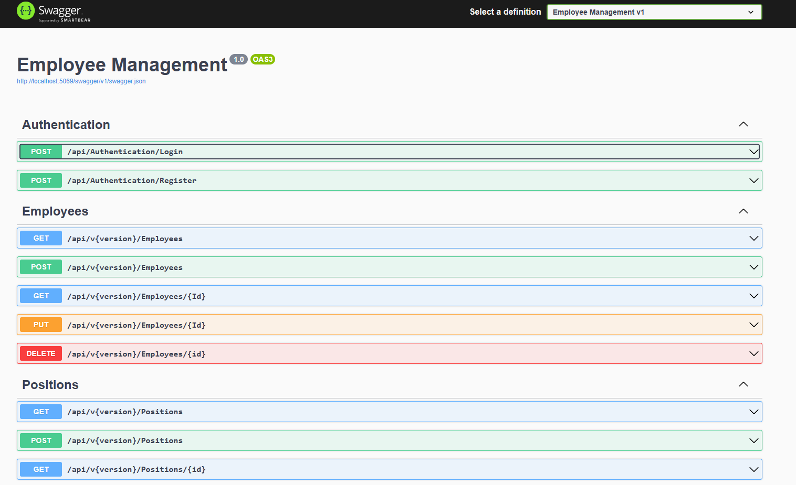

# Employee Management API

This is a learning project for building a RESTful API using ASP.NET Core for managing employees across different departments and positions in a fictitious company.

## Table of Contents

- [Features](#features)
- [Getting Started](#getting-started)
  - [Prerequisites](#prerequisites)
  - [Installation](#installation)
- [API Endpoints](#api-endpoints)
- [Authentication](#authentication)
- [API Versioning](#api-versioning)
- [Future Plans](#future-plans)
- [Collaboration](#future-plans)

## Features

- CRUD operations for managing employees
- JWT authentication for secure access
- User registration and login
- API versioning for better maintenance and backward compatibility
- Easy to extend for adding more features

## Getting Started

### Prerequisites

Make sure you have the following tools installed:

- [.NET Core SDK](https://dotnet.microsoft.com/download)
- [Visual Studio](https://visualstudio.microsoft.com/) or [Visual Studio Code](https://code.visualstudio.com/) (optional)

### Installation

1. Clone the repository:
   ```bash
   git clone https://github.com/yourusername/employeemanagement-api.git
2. Navigate to the project directory:
   ```bash
   cd employeemanagement-api
3. Restore dependencies:
    ```bash
    dotnet restore
4. Build the project:
    ```bash
    dotnet build
5. Run the application:
     ```bash
    dotnet run


## API Endpoints

- **GET /api/employees**: Retrieve a list of all employees.
- **GET /api/employees/{id}**: Retrieve details of a specific employee.
- **POST /api/employees**: Create a new employee.
- **PUT /api/employees/{id}**: Update details of a specific employee.
- **DELETE /api/employees/{id}**: Delete a specific employee.....(more see snippets)
### Snippet


Refer to the API documentation or use tools like Swagger for detailed endpoint information.

## Authentication

To access API resources, users must register and log in. JWT (JSON Web Token) authentication is implemented to secure endpoints.

To register a new user:

- **POST /api/account/register**

To log in:

- **POST /api/account/login**

Include the generated JWT token in the Authorization header of your requests to access protected resources.

## API Versioning

This API uses versioning to provide better control and backward compatibility. Currently supported versions:

- **v1** - `https://localhost:5001/api/v1/employees`

Specify the version in the URL to access the desired version of the API.

## Future Plans

This project is intended for learning purposes, and future plans include:

- Adding more features (e.g., employee departments, roles, get employees by pages....)
- Improving code structure and documentation
- Enhancing security measures
- Implementing unit tests

## Contributing

Contributions are welcome! If you have ideas for improvements, open an issue or submit a pull request.
